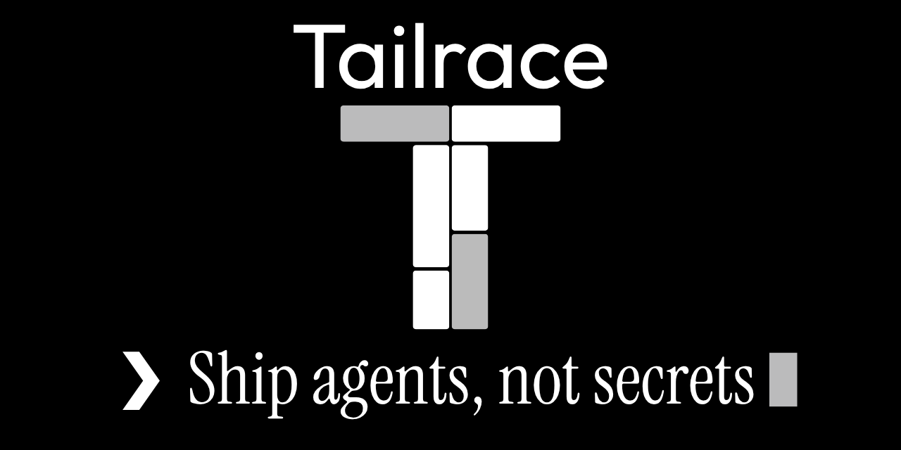

<p align="center">
  <a href="https://tailrace.dev">
    
  </a>
</p>

# Tailrace

**Agent data governance for TypeScript.** In-process detection of secrets and PII, reversible
workflow-scoped tokenization, and per-agent data-flow policy enforced at the model, tool, and MCP
boundaries. No proxy, no sidecar, no network call in the request hot path.

> Status: **v0.1 (milestone M5).** Detection, policy, vault, audit, AI SDK, MCP, Hono, and Claude
> Code CLI ship across `@tailrace/*`. See [`docs/milestones.md`](docs/milestones.md).

## Why

Agents move data across trust boundaries constantly - into model providers, out through tools, over
MCP. Tailrace sits in-process at those boundaries, detects sensitive values, and applies a policy you
control: block secrets, tokenize PII reversibly so the same value gets the same token across a whole
workflow, and restore it only at trusted egress.

## Packages

| Package                                                     | What it is                                                                                                    |
| ----------------------------------------------------------- | ------------------------------------------------------------------------------------------------------------- |
| [`@tailrace/core`](packages/core)                           | Detection, policy engine, vault, audit. Zero runtime deps; runs on Node, Cloudflare Workers, and Vercel Edge. |
| [`@tailrace/adapter`](packages/adapter)                     | Shared integration helpers: `wrapToolExecute`, `runGoverned`. No host peers.                                  |
| [`@tailrace/ai-sdk`](packages/ai-sdk)                       | Vercel AI SDK middleware + tool wrapper.                                                                      |
| [`@tailrace/cloudflare-agents`](packages/cloudflare-agents) | Cloudflare Agents / `AIChatAgent` compose entry (identity, vault, AI SDK wraps).                              |
| [`@tailrace/openai-agents`](packages/openai-agents)         | OpenAI Agents SDK function tool wrappers.                                                                     |
| [`@tailrace/mcp`](packages/mcp)                             | MCP client transport wrapper.                                                                                 |
| [`@tailrace/hono`](packages/hono)                           | Hono middleware (OpenAI-compatible passthrough).                                                              |
| [`@tailrace/cli`](packages/cli)                             | `tailrace` binary: `init`, `scan`, `install-hooks`, `hook`.                                                   |
| [`@tailrace/recognizer-ner`](packages/recognizer-ner)       | Optional Tier 1 ONNX NER recognizer (Node only).                                                              |

## Quickstart

```ts
import { createTailrace } from "@tailrace/core";
import { withAiSdk } from "@tailrace/ai-sdk";
import { openai } from "@ai-sdk/openai";

const tailrace = withAiSdk(createTailrace()); // zero config: secrets blocked, common PII tokenized
const model = tailrace.model(openai("gpt-4o"));
// Use `model` anywhere you'd use the AI SDK model - sensitive values never leave the process.
```

Also: [`@tailrace/mcp`](packages/mcp/README.md) (`withMcp` / `wrapTransport`) and
[`@tailrace/hono`](packages/hono/README.md) (`tailraceHono`) for MCP transports and OpenAI-compatible
gateways.

Runnable demos: [`examples/nextjs-ai-sdk`](examples/nextjs-ai-sdk),
[`examples/claude-code`](examples/claude-code).

## Documentation

| Resource                                                                                                                                                                                                                                                                                                                                                                                | Description                                           |
| --------------------------------------------------------------------------------------------------------------------------------------------------------------------------------------------------------------------------------------------------------------------------------------------------------------------------------------------------------------------------------------- | ----------------------------------------------------- |
| [Quickstart](apps/web/content/docs/get-started/quickstart.mdx)                                                                                                                                                                                                                                                                                                                          | Block a secret and tokenize email in five minutes     |
| Concepts: [Boundaries](apps/web/content/docs/concepts/boundaries.mdx) · [Policy resolution](apps/web/content/docs/concepts/policy-resolution.mdx) · [Detection tiers](apps/web/content/docs/concepts/detection-tiers.mdx) · [Tokenization & the vault](apps/web/content/docs/concepts/tokenization-and-the-vault.mdx) · [Threat model](apps/web/content/docs/concepts/threat-model.mdx) | The mental model, with diagrams                       |
| [Ship an agent](apps/web/content/docs/guides/ship-an-agent-on-vercel.mdx)                                                                                                                                                                                                                                                                                                               | Clone → verify → deploy: model, tools, egress restore |
| [Govern MCP tool calls](apps/web/content/docs/guides/govern-mcp-tool-calls.mdx)                                                                                                                                                                                                                                                                                                         | Transport wrap + JSON-RPC block                       |
| [Block secrets in Claude Code](apps/web/content/docs/guides/block-secrets-in-claude-code.mdx)                                                                                                                                                                                                                                                                                           | Hooks, scan, install-hooks                            |
| [@tailrace/ai-sdk reference](apps/web/content/docs/reference/ai-sdk/index.mdx)                                                                                                                                                                                                                                                                                                          | `wrapModel`, `wrapTools`, options                     |
| [Next.js](apps/web/content/docs/integrations/nextjs.mdx) · [MCP](apps/web/content/docs/integrations/mcp.mdx) · [Hono](apps/web/content/docs/integrations/hono.mdx) · [Claude Code](apps/web/content/docs/integrations/claude-code.mdx)                                                                                                                                                  | Integration pages                                     |
| [Integrations spec](docs/integrations.md)                                                                                                                                                                                                                                                                                                                                               | Normative behavior                                    |

Live docs: [tailrace.dev](https://tailrace.dev). Run locally: `pnpm --filter @tailrace/web dev`. Wiring
an AI tool into the docs (MCP, `llms.txt`, or per-page markdown):
[Use with AI tools](apps/web/content/docs/get-started/use-with-ai-tools.mdx).

## Development

```bash
pnpm install
pnpm build        # tsup: ESM + CJS + .d.ts for every package
pnpm test         # vitest (core also runs under workerd via test:workers)
pnpm lint
pnpm typecheck
pnpm bench        # perf gates; compared against benchmarks/baseline.json
```

Contributor guide and build order: [`AGENTS.md`](AGENTS.md). Specs: [`docs/`](docs). The specs are
normative - when in doubt, docs win.

### Releasing

Publishing is driven by [Changesets](https://github.com/changesets/changesets). Packages version
**independently** (no `fixed`/`linked` group). The publishable set is every non-private workspace under
`packages/*`; private workspaces (`apps/web`, `examples/*`, `benchmarks`) are never published and are
excluded automatically.

Runbook:

1. **Record intent.** For every package you changed, add a changeset: `pnpm changeset`. Pick the bump
   (patch/minor/major) per package. Don't hand-edit versions - Changesets owns them.
2. **Version.** `pnpm changeset version` applies the bumps and writes changelogs. Commit the result.
3. **Build.** `pnpm build` from the root - turbo builds every package in dependency order (ESM + CJS +
   `.d.ts`). Each package also has a `prepublishOnly` that rebuilds it at publish time, but building up
   front surfaces failures before you start publishing.
4. **Publish.** `pnpm release` (`changeset publish`). It publishes in topological order and **skips any
   version already on npm** - so re-running is safe and you can never clobber a published version. All
   nine packages are currently `0.1.0` on npm; the next release of any package must go through a
   changeset bump or `publish` will no-op on it.

Release-time invariants to preserve:

- **Align template-referenced packages when releasing the CLI.** `tailrace create` pins the
  `@tailrace/*` deps in every scaffold to the CLI's own version (`__TAILRACE_VERSION__` →
  `@tailrace/cli` version). The templates reference `@tailrace/core`, `@tailrace/ai-sdk`,
  `@tailrace/cloudflare-agents`, and `@tailrace/openai-agents`. Because versioning is independent, those
  four **must be published at the same version as the CLI** or a scaffolded project won't install. When
  cutting a CLI release, bump and publish them together at a matching version - don't add a Changesets
  `fixed` group to force it, align intentionally.
- **`@tailrace/cli` ships `templates/`.** Its `files` list is `["dist", "templates", "README.md"]`;
  without `templates`, `create` breaks for npm consumers.
- **Don't rename the template `gitignore` files.** They ship as `gitignore` (not `.gitignore`) because
  npm strips a literal `.gitignore` from published tarballs; `create` restores the leading dot on write.

## License

MIT
