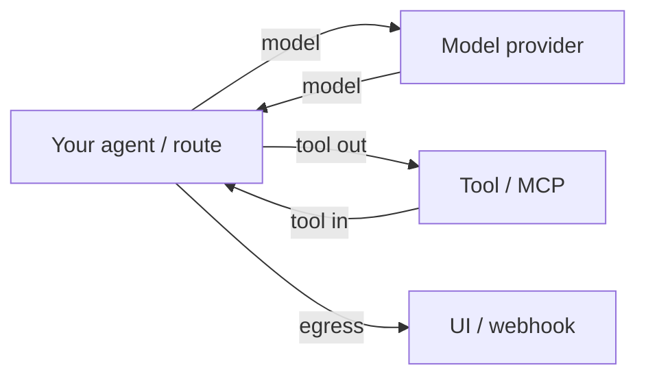

Why does the same email get different treatment when it hits a model call versus when it hits your UI?

Because Tailrace does not scan "the app." It scans **at boundaries** - typed places where data crosses a trust line. Every `check` / `restore` call names one.

## The five kinds

| Kind        | Meaning                                       | Typical call site                                 |
| ----------- | --------------------------------------------- | ------------------------------------------------- |
| `model`     | Prompt or completion to/from a provider       | `wrapModel` / `tailrace.model`                    |
| `tool`      | Args leaving the agent or results coming back | `wrapTools`, Claude Code PreToolUse / PostToolUse |
| `mcp`       | MCP `tools/call` / resource reads             | `wrapTransport` / `withMcp`                       |
| `telemetry` | Logs, traces, analytics sinks                 | Explicit `check` before emit                      |
| `egress`    | Trusted restore points (UI, email, webhook)   | `tailrace.restore`                                |

## Direction matters

`tool` and `mcp` carry `direction: "out" | "in"`:

- **out** - data leaving the agent (tool args, MCP call params)
- **in** - data returning (tool result, MCP response)

Policy keys encode direction (`tool:crm:out`), so you can tokenize outbound CRM writes while allowing inbound reads, or the reverse.

## Provider and name encoding

Boundary matching is **kind-scoped**:

- Model: bare provider globs - `openai/*`, `anthropic/claude-sonnet-4`
- Tool: `tool:{name}:{direction}`
- MCP: `mcp:{server}/{tool}`
- Egress: `egress:{sink}`
- Telemetry: `telemetry`

A model glob never matches a tool key. Exact keys beat longer globs; longer globs beat shorter ones.

## Egress is special

Detokenization is allowed **only** at `egress` sinks whose policy says `detokenize`. Calling `restore` at `model`, `tool`, `mcp`, or `telemetry` throws `InvariantViolationError` even if a policy document asks for it. Tokens stay opaque everywhere except the sinks you name.

## Identity rides along

Every check also carries an `Identity` (`agent` string, optional claims). Policy can override per agent. Integrations set this - they do not invent policy rules.

## See it in practice

- [Protect PII in the AI SDK](/docs/guides/protect-pii-in-ai-sdk) - model + tool boundaries
- [Govern MCP tool calls](/docs/guides/govern-mcp-tool-calls) - MCP out / in
- [Block secrets in Claude Code](/docs/guides/block-secrets-in-claude-code) - tool out / in via hooks
- [Policy resolution](/docs/concepts/policy-resolution) - how boundary + entity + identity pick an action
