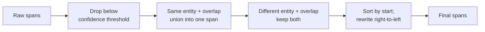

What does Tailrace actually find in a string or JSON object?

Detection produces **spans** (entity, offsets, confidence). It never chooses `block` or `tokenize` - that is policy's job. Engines are pluggable behind one `Recognizer` interface.

## Tier 0 (ships in `@tailrace/core`)

Synchronous, zero runtime dependencies, WebCrypto only. Pattern + validator where applicable.

**Secrets:** `api_key` (known prefixes), `jwt`, `private_key`, `high_entropy_secret` (entropy + keyword context), `connection_string`

**Structured PII:** `email`, `phone`, `credit_card` (Luhn), `iban`, `ssn`, `ip_address`, `url_credentials`

Confidence is `1.0` when a validator confirms, `0.8` for pattern-only. Spans below the configured threshold (default `0.6`) are dropped.

Honest expectation: Tier 0 is strong on structured shapes and known key prefixes. It is not a free-text NER. It will miss "John lives in Austin" and can false-positive without context gates (the high-entropy recognizer requires a nearby keyword for that reason).

## Tier 1 (optional `@tailrace/recognizer-ner`)

Quantized GLiNER-class ONNX model for `person`, `location`, `organization`. Node/Fluid only in v0.1 - not edge. Lazy-loaded; if the model file is missing, Tailrace logs a warning and continues with Tier 0 (fail open for availability).

Default policy does **not** enforce NER entities - they fall through to `allow` unless you set them.

## Custom recognizers

`defineRecognizer({ id, entities, tier, scan })` - pattern-based or arbitrary. Register via `createTailrace({ recognizers: [...] })`.

## Objects, not stringified blobs

`check` walks string leaves of JSON (depth-limited, cycle-safe). Spans carry an RFC 6901 JSON Pointer path. Keys are scanned too. Never serialize an object to one string for scanning - offsets and rewrites would break.

## Span merging

1. Drop low-confidence spans
2. Same entity, overlapping → union
3. Different entities, overlapping → keep both; policy picks most restrictive action
4. Sort by start; apply rewrites right-to-left

<Accordions>
  <Accordion title="Deep dive: why rewrites go right-to-left">

Every rewrite (`tokenize`, `mask`) changes the length of the string. If you
rewrote left-to-right, the first replacement would shift every later span's
offsets and you'd have to recompute them. Applying rewrites from the highest
start offset down means each edit only touches text after the spans you have
not processed yet, so their offsets stay valid until you reach them. Same idea
per string leaf when scanning objects: each leaf owns its offsets, and the JSON
Pointer path (e.g. `/messages/2/content`) tells `apply` exactly which leaf to
rewrite - which is why objects are never flattened to one string.

  </Accordion>
</Accordions>

## Perf gate

Tier 0 on a 4KB mixed fixture: p50 &lt; 5ms in CI. Detection is a commodity; policy and vault get the product effort.

## See it in practice

- [Playground](/docs/playground) - paste text, see Tier 0 spans client-side
- [Block secrets in Claude Code](/docs/guides/block-secrets-in-claude-code)
- [Threat model](/docs/concepts/threat-model) - what detection does not cover
