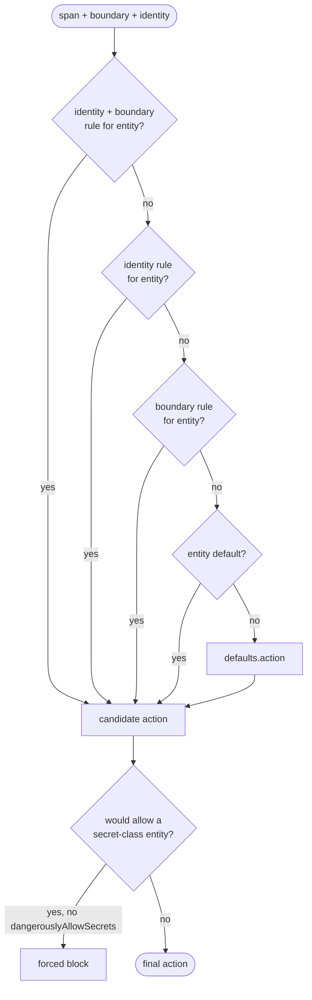

Given a detected span, a boundary, and an agent identity - which action wins?

That question is the whole product. Detection only finds entities. Integrations only call `check`. The policy engine decides.

## Actions

| Action       | Effect                                                        |
| ------------ | ------------------------------------------------------------- |
| `allow`      | Pass through; still audited                                   |
| `mask`       | Irreversible label like `[EMAIL]`                             |
| `tokenize`   | Reversible vault token                                        |
| `block`      | Throw `PolicyViolationError` (integrations translate)         |
| `detokenize` | Egress-only restore                                           |
| `review`     | Typed in v0.1; throws `NotImplementedError` at policy compile |

## Zero-config default

`createTailrace()` with no args:

| Entities                                            | Action                                      |
| --------------------------------------------------- | ------------------------------------------- |
| Secret classes (`api_key`, `jwt`, `private_key`, …) | `block`                                     |
| `email`, `phone`, `credit_card`, `iban`, `ssn`      | `tokenize`                                  |
| `ip_address`                                        | `allow`                                     |
| `url_credentials`                                   | `block`                                     |
| NER (`person`, `location`, `organization`)          | fall through to `defaults.action` (`allow`) |
| `egress:*`                                          | `detokenize`                                |

## Precedence (most specific first)

For entity `E`, boundary `B`, identity `I`:

1. `identities[I.agent].boundaries[B].entities[E]`
2. `identities[I.agent].entities[E]`
3. `boundaries[B].entities[E]`
4. `entities[E].action`
5. `defaults.action`

First hit wins - with one hard exception.

## Secrets cannot be allowed by accident

If any rule would `block` a **secret-class** entity, a more specific rule cannot override that to `allow` unless it sets `dangerouslyAllowSecrets: true`. Deliberate friction so a support-agent override cannot quietly ship API keys to a model.

## Overlapping spans

When spans overlap after merge, the most restrictive action wins:

`block` > `review` > `tokenize` > `mask` > `allow`

## Worked example

A Stripe test key in a tool argument for agent `support-bot`:

1. Detect → `api_key`
2. Boundary → `{ kind: "tool", name: "Bash", direction: "out" }`
3. Identity → `{ agent: "support-bot" }`
4. Resolve → default secret `block` (unless a `dangerouslyAllowSecrets` rule exists)
5. Integration → Claude Code deny JSON / AI SDK tool error string / thrown `PolicyViolationError`

An `example.com` email on the same path resolves to `tokenize` under the default policy - rewrite in place, vault write, audit decision with `contentHash` (never the raw value).

## Resolution is pure and sync

`resolve(policy, entity, boundary, identity)` does map lookups only (precompiled at `createTailrace`). Target: under 1µs per span. No I/O in the resolve path.

<Accordions>
  <Accordion title="Deep dive: how resolution stays sub-microsecond">

`createTailrace` compiles your policy document once, up front. Each precedence
level becomes a flat lookup keyed by the strings it matches on:

- `identities[agent].boundaries[key].entities[entity]`
- `identities[agent].entities[entity]`
- `boundaries[key].entities[entity]`
- `entities[entity]`

At request time `resolve` walks those maps in order and returns the first hit.
There is no regex, no allocation, and no I/O on this path - just object property
reads - which is what keeps it under 1µs per span.

The secret guard is precomputed too: the set of secret-class entities is fixed
at compile time, so the "would this allow a secret?" check is a single set
membership test that only runs when the winning action is `allow`. That is why
the guard can be a hard invariant rather than a policy option.

  </Accordion>
</Accordions>

## See it in practice

- [Protect PII in the AI SDK](/docs/guides/protect-pii-in-ai-sdk)
- [Boundaries](/docs/concepts/boundaries)
- Spec: policy engine (repo `docs/policy-engine.md`)
