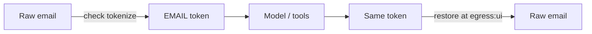

Why does the same email become the same token at steps 1, 17, and 42 of an agent run?

Because tokens are **workflow-scoped and deterministic**: HMAC over `(workflowId, entityClass, normalizedValue)`, not random IDs.

## Token shape

```
tokenId = encode(HMAC-SHA256(workflowKey, entityClass || value))[0..8]
token   = <EMAIL_a3f2k9qx>
```

- `workflowKey` derives from your master key + `workflowId`
- Alphabet is lowercase alphanumeric `[a-z0-9]` (shared by mint and restore)
- No `workflowId` ⇒ `"default"` (fine for demos; use a real session id in production)

## Vault adapters

| Adapter          | Use                                         |
| ---------------- | ------------------------------------------- |
| `memoryVault()`  | Default; process-local Map + TTL            |
| `kvVault(store)` | Cloudflare KV-shaped `{ get, put, delete }` |

Values at rest are **AES-256-GCM** encrypted (key derived from the master key). Default TTL is 24h. A leaked KV namespace without the key does not yield plaintext PII.

Claude Code hooks are separate processes - they use a file-backed `kvVault` under `.tailrace/vault/` with a stable `TAILRACE_VAULT_KEY` / config key so tokens survive across tool calls in one session.

## Format-preserving mode

Optional per entity (`format: "preserve"`):

- Credit cards → Luhn-valid test-range digits (shape kept)
- Email → `{tokenId}@redacted.example`
- Phone → `+1555…` fictional range

Everything else stays `<LABEL_id>`.

## Restore only at egress

`tailrace.restore` scans for token patterns and looks them up in the vault. It runs only when:

1. Boundary kind is `egress`
2. Policy for that sink says `detokenize`

Unknown or expired tokens stay as-is (`restore_miss` audit) - old transcripts should not crash the host.

Calling `restore` at any other boundary throws `InvariantViolationError`.



## Streaming

Model output arrives in chunks. Entities and tokens can split across chunk boundaries. Integrations keep a hold-back buffer and never emit a bisected span - see AI SDK streaming modes in the guide.

## See it in practice

- [Protect PII in the AI SDK](/docs/guides/protect-pii-in-ai-sdk) - tokenize + restore at `egress:ui`
- Demo 3 in `examples/nextjs-ai-sdk` - identical token across 50 steps
- [Policy resolution](/docs/concepts/policy-resolution)
