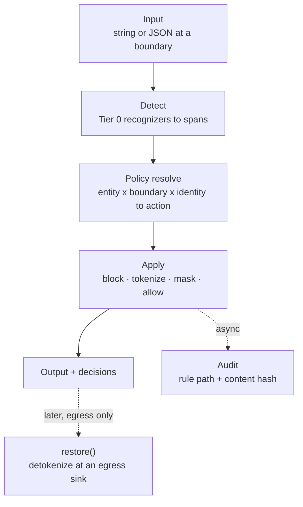

Tailrace is agent data governance for TypeScript. It sits **inside your process** at model, tool, and MCP boundaries - detecting secrets and PII, applying policy, and restoring tokenized values only where you trust.

No proxy. No sidecar. No required network call on the request hot path.

<FlowDemo />

## The pipeline

Every `check` follows the same path:

1. **Input**: A string or JSON object crosses a boundary (model prompt, tool args, MCP payload).
2. **Detect**: Tier 0 recognizers find entity spans with JSON-pointer paths.
3. **Policy resolve**: For each span: `entity × boundary × identity → action`.
4. **Apply**: `block` throws · `tokenize` writes the vault · `mask` replaces inline · `allow` passes through.
5. **Audit**: Async emit with rule path and content hash; never raw values.



**Restore** is separate: `tailrace.restore()` runs only at `{ kind: "egress", sink }` boundaries. Calling restore at a model or tool boundary throws - by design.

## Default policy

`createTailrace()` with no arguments:

| Entity                                       | Action         |
| -------------------------------------------- | -------------- |
| Secrets (`api_key`, `jwt`, `private_key`, …) | **block**      |
| Email, phone, credit card, IBAN, SSN         | **tokenize**   |
| IP address                                   | allow          |
| Egress sinks (`egress:*`)                    | **detokenize** |

Secrets cannot be overridden to `allow` without `dangerouslyAllowSecrets: true`.

## Where Tailrace sits

```text
Your app ──► wrapModel / wrapTools / MCP wrapper ──► tailrace.check ──► provider or tool
                                                      │
                                                      └──► audit (async)
```

For the Vercel AI SDK, one line wraps the model:

```ts
const model = tailrace.model(openai("gpt-4o"));
```

## Next steps

| Goal                             | Link                                                            |
| -------------------------------- | --------------------------------------------------------------- |
| Block a fake key in five minutes | [Quickstart](/docs/get-started/quickstart)                      |
| Connect Cursor / Claude to docs  | [Use with AI tools](/docs/get-started/use-with-ai-tools)        |
| Clone, verify, and deploy to Vercel | [Ship an agent](/docs/guides/ship-an-agent-on-vercel) |
| MCP transports                   | [Govern MCP tool calls](/docs/guides/govern-mcp-tool-calls)     |
| Hono OpenAI passthrough          | [Hono integration](/docs/integrations/hono)                     |
| Concepts                         | [Boundaries](/docs/concepts/boundaries)                         |
